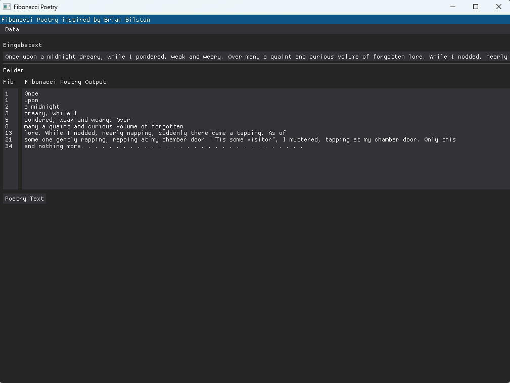

# 📜 FibonacciPoetry

**FibonacciPoetry** ist ein unterhaltsames kleines Projekt, das Wort-Artistik und Programmieren miteinander verbindet.  
Inspiriert von einem humorvollen Facebook-Post des Dichters *Brian Bilston* erzeugt dieses Tool eine „Fibonacci-Poesie“ aus einem eingegebenen Text, indem es die Wörter in Zeilen anordnet, deren Länge der klassischen Fibonacci-Folge folgt.

➡️ Aus einem beliebigen Satz entsteht so ein poetisches Muster nach:  
**1, 1, 2, 3, 5, 8, … Wörter pro Zeile**

---

## 📌 Idee & Konzept

Im Zentrum steht die Frage:

> *Wie sieht ein Gedicht aus, wenn jede Zeile eine Länge gemäß der Fibonacci-Zahlen hat?*

Du gibst einen Text ein, der Parser zählt die Wörter und schreibt sie zeilenweise so, dass jede Zeile genau der nächsten Zahl in der Fibonacci-Folge entspricht.  
Das Ergebnis ist ein kleines, mathematisch inspiriertes Gedicht – ein spielerischer Hybrid aus Algorithmus und Lyrik.

---

## 🚀 Funktionsweise

1. **Eingabe eines Textes**  
2. **Zerlegung in einzelne Wörter**
3. **Berechnung der Fibonacci-Folge**
4. **Ausgabe des Textes in Zeilen mit Fibonacci-Wortlängen**

---

## 🗂️ Projektdateien

| Datei | Beschreibung |
|------|--------------|
| `Program.cs` | Einstiegspunkt des Programms. Verantwortlich für Benutzereingabe und Ausgabe. |
| `FibonacciPoetry.cs` | Enthält die Kernlogik zur Erzeugung der Fibonacci-Poesie (Wortverteilung und Folgenberechnung). |
| `README.md` | Projektdokumentation. |

---

## 📦 Beispiel

Eingabe:

```
Dies ist ein kurzes Beispiel um zu zeigen wie die Fibonacci Poesie funktioniert
```

Ausgabe:

```
Dies
ist
ein kurzes
Beispiel um zu
zeigen wie die
Fibonacci Poesie funktioniert
```

---

## 💡 Motivation & Charakter des Projekts

Dieses Projekt ist **bewusst humorvoll und experimentell** angelegt.  
Es verfolgt keinen produktiven Zweck, sondern zeigt auf spielerische Weise:

- algorithmisches Denken
- Textverarbeitung
- kreative Programmierung

Inspiriert durch eine Idee aus sozialen Medien verbindet es Mathematik und Sprache zu einem kleinen Code-Experiment.

---

## 🧑‍💻 Nutzung

```bash
git clone https://github.com/Noha1981/FibonacciPoetry.git
```

## 📦 Installation

### Voraussetzungen

- Python **3.10 oder neuer**

Python kann von der offiziellen Website heruntergeladen werden:  
https://www.python.org/downloads/

> Hinweis: Unter Windows darauf achten, dass „Add Python to PATH“ beim Setup aktiviert ist.

---

## Dependencies

- dearpygui
- pytest (used for CI testing)


### Abhängigkeiten installieren

Dieses Projekt nutzt externe Python-Bibliotheken.

Installation über `pip`:

```bash
pip install -r requirements.txt
```
## 📜 Lizenz

MIT License – freie Nutzung, Modifikation und Weitergabe erlaubt.


## 🖼️ Screenshot


